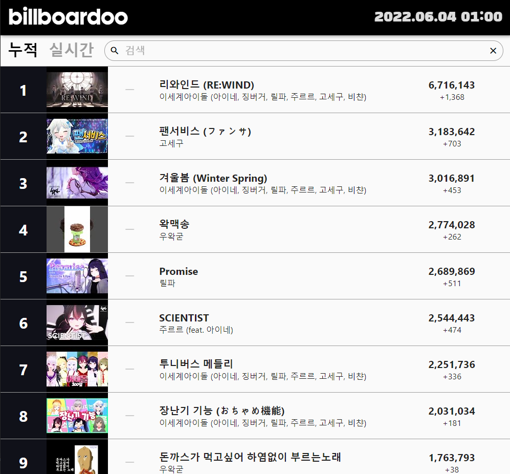
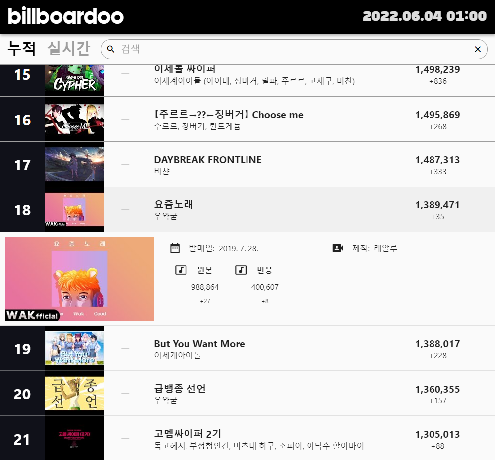

# Billboardoo Chart
[우왁굳](https://www.youtube.com/user/woowakgood) 과 [왁타버스](https://www.youtube.com/c/welshcorgimessi) (이세계아이돌, 고멤 등)에 관련된 유튜브 영상들의 조회수 순위를 매긴 웹페이지입니다.  
1시간 마다 차트가 자동으로 업데이트 됩니다.  
  
Youtube Views Chart for musics about [woowakgood](https://www.youtube.com/user/woowakgood) and [WAKTAVERSE](https://www.youtube.com/c/welshcorgimessi).  
Chart is automatically updated every hour.  
  
링크: [Web Page Link](http://138.2.119.187/#/)  

### Current Views (누적)
누적 조회수에 대한 차트  
Show current chart of views  
<p align="center">
  
</p>

### Real-time Views (실시간)
1시간 동안 증가한 조회수에 대한 차트  
Show real-time chart of views for last 1 hour  
<p align="center">
  
</p>

### Details
음악을 클릭하면 발매일, 제작자, 원본과 반응 영상 링크를 확인할 수 있습니다.  
Click music to see details. You can see release date, composer, and Youtube links of original music and its reaction (if it exists).  
<p align="center">
  
</p>

### How the chart updates every hour
1. Use `forever` to run `json-server` 24 hours
```
forever start /usr/local/bin/json-server ~/my-json-server/db.json --port 3001 -H 0.0.0.0
```
2. Use `crontab` to run bash file `update_every_hour.sh` every hour
```
59 * * * * ~/my-json-server/update_every_hour.sh > ~/my-json-server/cron_result.txt 2>&1
```
3. The bash file backups `db.json`, updates `db.json` by python file `updatejson.py`, and restart `forever`  
   It is necessary to restart `forever` because `json-server` sends the old `db.json` file to web page even though `updatejson.py` updates `db.json`.
```
#!/bin/bash

cp ~/my-json-server/db.json ~/my-json-server/db_backup.json
python3 ~/my-json-server/updatejson.py --show=True > ~/my-json-server/log.txt
/usr/local/bin/forever restartall
``` 
4. How `updatejson.py` updates Youtube views in `db.json`.
```
from bs4 import BeautifulSoup
import requests
import re
import json
import datetime
import pytz
import argparse

def num(string):
    return int(re.sub(r'[^0-9]', '', string))

def getView(url, showlog = False):
    view = re.compile('"viewCount":"[0-9]+"')
    response = requests.get(url)

    try:
        if response.status_code == 200:
            html = response.text
            soup = BeautifulSoup(html, 'html.parser')
            v = num(view.search(str(soup)).group())
            if showlog: print(f"{url}: {v}", end="")
            return v
        else:
            raise Exception(f'No Response: {response.status_code}')
    except Exception as e:
        print(f"{url}: {e}")

def updateJSON(data, showlog = False):
    for i, d in enumerate(data['music']):
        if showlog: print(f"({i}) ", end="")
        view = d['view']
        d['view'] = getView(d['url'], showlog)
        d['viewInc'] = d['view'] - view

        if (len(d['url2']) > 0) :
            if showlog: print(" / ", end="")
            view = d['view2']
            d['view2'] = getView(d['url2'], showlog)
            d['view2Inc'] = d['view2'] - view

        if showlog: print()

    data['music'].sort(key = lambda d: d['viewInc']+d['view2Inc'], reverse=True)

    for i, d in enumerate(data['music']):
        if 'incRank' in d.keys():
            rank = d['incRank']
            d['incRank'] = i + 1
            if rank == 0:
                d['incRankChange'] = ''
            else:
                d['incRankChange'] = str(rank - i - 1)
        else:
            d['incRank'] = i + 1
            d['incRankChange'] = ''

    data['music'].sort(key = lambda d: d['view']+d['view2'], reverse=True)

    for i, d in enumerate(data['music']):
        rank = d['rank']
        d['rank'] = i + 1
        if rank == 0:
            d['rankChange'] = ''
        else:
            d['rankChange'] = str(rank - i - 1)

    KST = pytz.timezone('Asia/Seoul')
    dt = datetime.datetime.now(KST).strftime('%Y.%m.%d %H:00')
    if showlog: print(f"Update Time: {dt}")
    data['update'] = {'date': dt}

    return data

def get_args():
    parser = argparse.ArgumentParser()
    parser.add_argument("--show", required=False, default=False, type=lambda s: s.lower() in ['true'])
    args = parser.parse_args()
    return args.show

if __name__ == "__main__":
    showlog = get_args()
    json_data = {}

    with open("/home/ubuntu/my-json-server/db.json", "r") as json_file:
        json_data = json.load(json_file)

    json_data = updateJSON(json_data, showlog=showlog)

    with open("/home/ubuntu/my-json-server/db.json", "w") as json_file:
        json.dump(json_data, json_file, ensure_ascii = False)
```